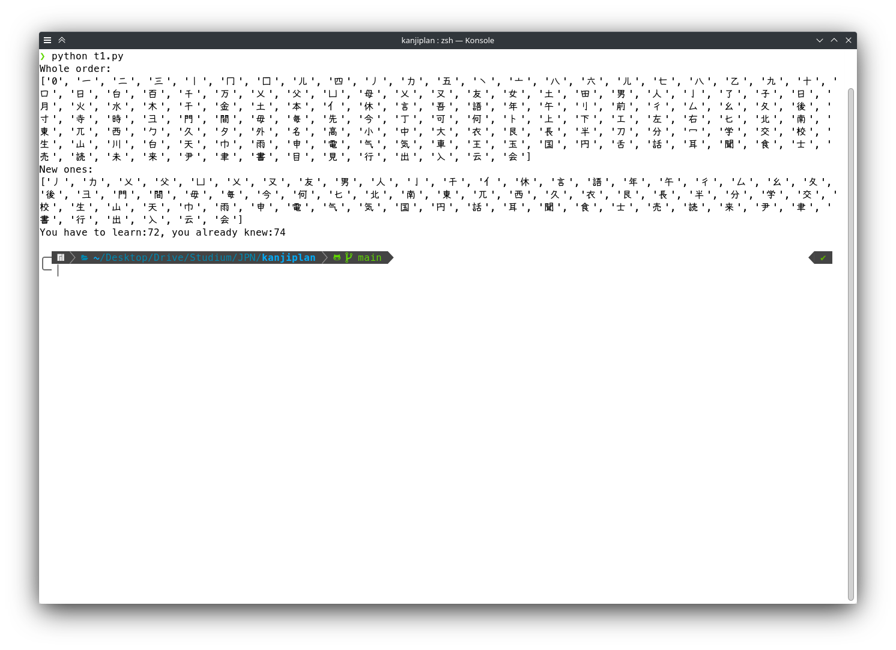

Note: I made an improved, graphical version of this script. Find it under [this link](https://github.com/finia2NA/kanjiorder-v2)

# Kanjiorder
Program to help determine the order you should learn kanji.  
provide known.txt and target.txt, then run.

Example output:

The Kanji list (topology.json) is by [Dmitry Shpika](https://github.com/scriptin/topokanji), used under [CC-BY-4.0 license](https://creativecommons.org/licenses/by/4.0/).
